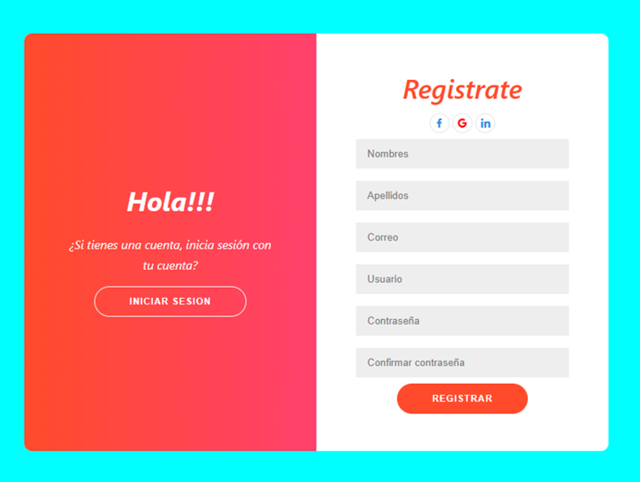
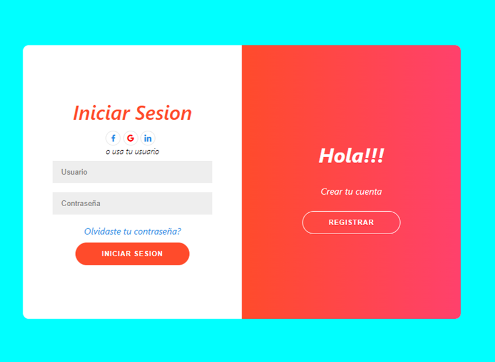

# 📌 Registro y Login con LocalStorage en React

Este proyecto implementa un sistema de registro y login utilizando `localStorage` en React. Se permite el registro de múltiples usuarios y la autenticación basada en credenciales almacenadas.

## 🚀 Funcionalidades
- Registro de usuarios con almacenamiento en `localStorage`.
- Validación para evitar registros duplicados.
- Inicio de sesión con verificación de credenciales.
- Redirección tras un inicio de sesión exitoso.

---

## 📥 Instalación y Configuración
1. Clona este repositorio:
    ```bash
   git clone (url)
   ```
2. Instala las dependencias:
   ```bash
   npm install
   ```
3. Inicia la aplicación:
   ```bash
   npm run dev
   ```

🖼 **Interfaz de Registro**



🖼 **Interfaz de Login**



